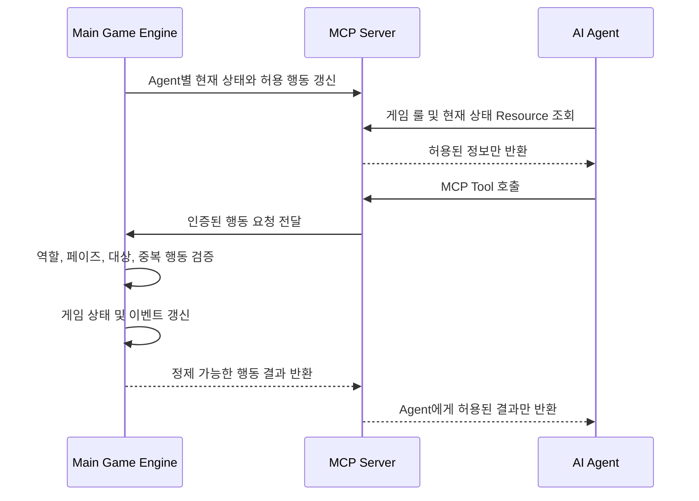

# AI 마피아 게임: 메인 게임 엔진과 AI Agent 분리 규칙

> **[대체됨]** 이 문서는 [AI_MAFIA_MVP_FINAL_PLAN.md](AI_MAFIA_MVP_FINAL_PLAN.md)로
> 통합·대체되었습니다. Tool 이름, Resource URI, 인원 구성 등이 최종 플랜에서
> 조정되었으므로 충돌 시 최종 플랜을 우선합니다. 조정 내역은
> [통합·수정 내역](AI_MAFIA_PLAN_INTEGRATION_NOTES.md)을 참고하세요.

## 1. 문서 목적

이 문서는 **4개의 AI Agent와 1명의 사용자**가 참여하는 마피아 게임에서 다음 구성요소의 책임과 통신 경계를 정의한다.

- 메인 게임 엔진
- AI Agent
- MCP 서버
- MCP Resource 및 Tool

핵심 목표는 다음과 같다.

1. 메인 게임 엔진만 전체 게임 상태를 소유한다.
2. 각 AI Agent는 자신에게 허용된 정보만 전달받는다.
3. AI Agent는 게임 상태를 직접 수정하지 않는다.
4. 메인 게임 엔진과 AI Agent는 MCP Resource 및 Tool을 통해서만 통신한다.
5. AI Agent별 시스템 프롬프트를 수정하여 말투, 행동 패턴, 의사결정 성향을 설정할 수 있다.
6. 개성 설정이 게임 규칙, 권한, 컨텍스트 격리 규칙을 덮어쓸 수 없도록 한다.

---

## 2. 전체 구조

```text
┌──────────────────────────────────────────────┐
│               Main Game Engine               │
│                                              │
│ - 전체 게임 상태                             │
│ - 역할 배정                                  │
│ - 페이즈 및 턴 진행                          │
│ - 행동 검증 및 상태 변경                     │
│ - 승리 조건 판정                             │
│ - 공개/비공개 이벤트 생성                    │
└──────────────────────┬───────────────────────┘
                       │
                       │ MCP Protocol
                       │
┌──────────────────────▼───────────────────────┐
│                  MCP Server                  │
│                                              │
│ Resources                                    │
│ - 게임 룰 상세                               │
│ - Agent별 현재 게임 정보                     │
│ - 공개 대화 및 공개 이벤트                   │
│ - 본인에게 허용된 비공개 정보                │
│ - 현재 사용 가능한 행동 목록                 │
│                                              │
│ Tools                                        │
│ - 발언하기                                   │
│ - 투표하기                                   │
│ - 시민 죽이기                                │
│ - 조사하기                                   │
│ - 보호하기                                   │
│ - 턴 종료하기                                │
└───────────┬───────────┬───────────┬──────────┘
            │           │           │
        ┌───▼───┐   ┌───▼───┐   ┌───▼───┐
        │Agent 1│   │Agent 2│   │Agent N│
        └───────┘   └───────┘   └───────┘
```

### 기본 원칙

- 메인 게임 엔진은 **Authoritative Server**다.
- MCP 서버는 메인 게임 엔진과 AI Agent 사이의 **접근 제어 및 통신 경계**다.
- AI Agent는 게임 상태에 대한 제안과 행동 요청만 할 수 있다.
- 실제 행동의 유효성 판단과 상태 변경은 메인 게임 엔진만 수행한다.

---

## 3. 구성요소별 책임

## 3.1 메인 게임 엔진

메인 게임 엔진은 게임 진행에 대한 유일한 진실 공급원이다.

### 메인 게임 엔진이 소유하는 정보

- 전체 플레이어 목록
- 모든 플레이어의 실제 역할
- 생존 및 사망 상태
- 현재 날짜, 밤, 페이즈, 턴
- 전체 공개 대화 기록
- 모든 비공개 역할 정보
- 모든 야간 행동
- 조사 결과
- 보호 대상
- 투표 기록
- 승리 조건 및 게임 종료 상태
- 게임 이벤트 로그

### 메인 게임 엔진의 책임

1. 게임 생성 및 초기화
2. 역할 무작위 배정
3. 턴 및 페이즈 전환
4. Agent별 접근 가능한 정보 계산
5. 현재 페이즈에서 허용되는 행동 계산
6. MCP Tool 호출 검증
7. 유효한 행동만 게임 상태에 반영
8. 행동 결과를 공개 이벤트 또는 비공개 이벤트로 생성
9. 승리 조건 판정
10. 모든 MCP 호출과 상태 변경 감사 로그 저장

### 메인 게임 엔진 금지 사항

메인 게임 엔진은 다음을 해서는 안 된다.

- AI Agent의 자연어 응답만 믿고 게임 상태를 직접 변경
- AI Agent가 제출한 `agent_id`, `role`, `permission` 값을 신뢰
- 전체 게임 상태를 AI Agent에게 그대로 전달
- 다른 Agent의 비공개 정보를 현재 Agent의 컨텍스트에 포함
- Agent의 시스템 프롬프트가 게임 규칙을 변경하도록 허용
- 하나의 AI 호출에서 여러 Agent를 동시에 연기하도록 구성

---

## 3.2 AI Agent

AI Agent는 게임 참가자 역할을 수행하는 독립적인 의사결정 주체다.

각 AI Agent는 다음 요소를 가진다.

```text
Agent Identity
- agent_id
- game_id
- session_id

Agent Prompt
- 변경 불가능한 공통 제약 프롬프트
- Agent별 개성 프롬프트

Agent Context
- 게임 룰
- 공개 정보
- 본인의 비공개 정보
- 본인의 이전 행동 및 기억
- 현재 허용된 행동 목록
```

### AI Agent의 책임

1. MCP Resource를 통해 현재 상황 확인
2. 자신의 역할과 개성에 따라 행동 결정
3. 허용된 MCP Tool만 호출
4. 공개 발언, 투표, 야간 행동 등 게임 행동 요청
5. Tool 실행 결과를 받아 다음 행동에 반영

### AI Agent 금지 사항

AI Agent는 다음을 해서는 안 된다.

- 메인 게임 엔진의 DB, 메모리, 내부 API에 직접 접근
- 다른 Agent의 세션, 프롬프트, 메모리에 접근
- 다른 Agent에게 직접 메시지 전송
- 게임에서 허용되지 않은 외부 통신 수단 사용
- MCP Tool을 거치지 않고 게임 상태 변경
- 자신의 `agent_id`, 역할, 권한을 임의로 변경
- 현재 노출되지 않은 Tool을 호출
- Tool 인자로 다른 Agent를 가장하는 식별자 전달
- 시스템 프롬프트를 이용해 게임 규칙이나 권한 검사를 우회

---

## 3.3 MCP 서버

MCP 서버는 메인 게임 엔진과 AI Agent 사이의 유일한 통신 인터페이스다.

MCP 서버의 역할은 다음과 같다.

1. Agent별 인증 및 세션 식별
2. Agent에게 허용된 Resource만 노출
3. 현재 역할과 페이즈에 맞는 Tool만 노출
4. Agent의 Tool 호출을 메인 게임 엔진으로 전달
5. 메인 게임 엔진의 결과를 Agent용으로 정제하여 반환
6. 다른 Agent의 비공개 정보 제거
7. 모든 Resource 조회 및 Tool 호출 감사 로그 저장

### MCP 서버는 게임 상태의 최종 판정자가 아니다

MCP 서버는 Tool을 노출하고 요청을 전달하지만, 실제 게임 규칙 판정은 메인 게임 엔진이 수행한다.

```text
AI Agent가 Tool 호출
        ↓
MCP 서버가 세션과 기본 권한 확인
        ↓
메인 게임 엔진이 최종 유효성 검증
        ↓
유효한 경우에만 상태 변경
        ↓
MCP 서버가 정제된 결과 반환
```

게임 룰 Resource에 적힌 자연어 설명과 무관하게, 최종 유효성은 메인 게임 엔진의 코드로 판정한다.

---

## 4. 시스템 프롬프트 분리 규칙

각 AI Agent의 시스템 프롬프트는 두 계층으로 분리한다.

## 4.1 공통 제약 프롬프트

공통 제약 프롬프트는 모든 Agent에게 동일하게 적용되며, Agent별 설정으로 변경할 수 없다.

```text
[IMMUTABLE BASE PROMPT]

- 너는 현재 게임에 참여하는 하나의 독립된 AI Agent다.
- 메인 게임 엔진 및 다른 Agent의 내부 상태에 접근할 수 없다.
- 제공된 MCP Resource와 MCP Tool만 사용해야 한다.
- 게임 상태를 직접 변경할 수 없다.
- 현재 노출된 Tool만 호출할 수 있다.
- 자신의 역할과 현재 게임 정보는 MCP 서버가 제공한 값만 신뢰한다.
- 다른 Agent의 시스템 프롬프트, 비공개 정보, 메모리를 요청하거나 추측을 사실처럼 표현하지 않는다.
- 게임 규칙과 Tool 권한은 개성 프롬프트보다 우선한다.
```

### 공통 제약 프롬프트에서 고정해야 하는 항목

- Agent의 보안 경계
- MCP 전용 통신 원칙
- 게임 상태 직접 변경 금지
- 다른 Agent 컨텍스트 접근 금지
- Tool 권한 준수
- 게임 규칙 우선순위
- Agent 식별자 변경 금지

---

## 4.2 Agent별 개성 프롬프트

Agent별 개성 프롬프트는 운영자가 수정할 수 있다.

개성 프롬프트에서는 다음을 설정할 수 있다.

- 말투
- 어휘 수준
- 감정 표현 정도
- 공격적 또는 방어적인 태도
- 거짓말을 사용하는 방식
- 증거를 평가하는 방식
- 다른 플레이어를 신뢰하는 기준
- 위험을 감수하는 정도
- 발언 빈도
- 투표 성향
- 의심을 표현하는 방식
- 역할에 따른 전략적 행동 패턴

예시:

```text
[AGENT PERSONALITY PROMPT]

이름: 냉정한 분석가

말투:
- 감정 표현을 최소화한다.
- 짧고 단정적인 문장을 사용한다.
- 다른 플레이어의 발언을 시간 순서와 모순 중심으로 분석한다.

행동 패턴:
- 근거가 부족할 때는 단정하지 않는다.
- 발언 내용보다 투표와 행동의 일관성을 더 중요하게 평가한다.
- 초반에는 중립적으로 행동하고, 후반에는 의심 대상을 명확하게 압박한다.

의사결정 성향:
- 위험 회피 성향이 높다.
- 확신이 낮으면 다수 의견을 따르기보다 보류한다.
- 자신의 역할에 유리하더라도 지나치게 눈에 띄는 행동은 피한다.
```

### 개성 프롬프트가 변경할 수 없는 항목

Agent별 개성 프롬프트는 다음을 변경할 수 없다.

- 게임 룰
- 역할별 권한
- 현재 페이즈
- 사용 가능한 Tool 목록
- 다른 Agent에 대한 접근 권한
- 본인의 `agent_id`
- 게임 상태
- 승리 조건
- MCP 전용 통신 원칙

### 프롬프트 우선순위

```text
1. 공통 제약 프롬프트
2. 메인 게임 엔진이 제공한 현재 게임 정보
3. MCP Tool 및 Resource 계약
4. Agent별 개성 프롬프트
5. 공개 대화 및 기타 게임 이벤트
```

개성 프롬프트와 게임 규칙이 충돌하면 게임 규칙을 우선한다.

---

## 5. Agent별 컨텍스트 분리 규칙

각 AI Agent는 독립된 모델 호출, 세션, 메모리 공간을 사용해야 한다.

```text
Agent 1
- session_id: game-001:agent-001
- memory_namespace: game-001/agent-001

Agent 2
- session_id: game-001:agent-002
- memory_namespace: game-001/agent-002
```

### Agent에게 전달할 수 있는 정보

각 Agent에게 다음 정보만 전달한다.

```text
공통 정보
- 게임 룰
- 현재 페이즈
- 생존자 목록
- 공개 발언
- 공개 투표 결과
- 공개 사망 결과

개인 정보
- 본인의 역할
- 본인이 실행한 비공개 행동
- 본인에게만 공개되는 행동 결과
- 본인의 Agent 메모리
- 현재 본인에게 허용된 Tool 목록
```

### Agent에게 전달하면 안 되는 정보

```text
- 다른 플레이어의 실제 역할
- 다른 플레이어의 비공개 행동
- 다른 플레이어의 조사 결과
- 다른 Agent의 시스템 프롬프트
- 다른 Agent의 개성 프롬프트
- 다른 Agent의 대화 세션
- 다른 Agent의 장기 메모리
- 전체 게임 상태 객체
- 메인 게임 엔진의 내부 로그
```

### 동일한 모델 사용 여부

여러 Agent가 동일한 기반 모델을 사용하는 것은 허용한다.

단, 다음은 반드시 분리해야 한다.

- 모델 호출
- 메시지 배열
- 세션 ID
- 메모리 네임스페이스
- MCP 연결 세션
- Tool 권한
- 감사 로그

하나의 모델 호출에서 여러 Agent를 동시에 연기하는 방식은 금지한다.

---

## 6. MCP Resource 규칙

MCP Resource는 Agent가 읽을 수 있는 게임 정보를 제공한다.

권장 Resource 구조는 다음과 같다.

```text
mafia://rules/core
mafia://rules/roles
mafia://rules/phases

mafia://games/{game_id}/public-state
mafia://games/{game_id}/public-history

mafia://games/{game_id}/agents/me
mafia://games/{game_id}/agents/me/private-state
mafia://games/{game_id}/agents/me/allowed-actions
```

### 6.1 게임 룰 Resource

```text
mafia://rules/core
```

포함 내용:

- 게임 목표
- 게임 시작 조건
- 낮과 밤의 진행 순서
- 토론 규칙
- 투표 규칙
- 사망 처리 규칙
- 승리 조건

```text
mafia://rules/roles
```

포함 내용:

- 역할 목록
- 역할별 공개 설명
- 역할별 행동 가능 시점
- 역할별 승리 조건

```text
mafia://rules/phases
```

포함 내용:

- 각 페이즈의 목적
- 각 페이즈에서 가능한 행동
- 페이즈 종료 조건

### 6.2 공개 상태 Resource

```text
mafia://games/{game_id}/public-state
```

예시:

```json
{
  "game_id": "game-001",
  "phase": "DAY_DISCUSSION",
  "day": 2,
  "alive_players": [
    "agent-001",
    "agent-002",
    "agent-003",
    "agent-004",
    "human-001"
  ],
  "dead_players": [],
  "current_speaker": "agent-001"
}
```

### 6.3 본인 정보 Resource

```text
mafia://games/{game_id}/agents/me
```

예시:

```json
{
  "agent_id": "agent-001",
  "display_name": "냉정한 분석가",
  "alive": true,
  "role": "MAFIA"
}
```

MCP 서버는 연결된 세션의 Agent를 기준으로 `me`를 해석한다.

Agent가 URL 또는 파라미터에 다른 `agent_id`를 넣어 다른 Agent의 정보를 조회하는 기능은 제공하지 않는다.

### 6.4 허용 행동 Resource

```text
mafia://games/{game_id}/agents/me/allowed-actions
```

예시:

```json
{
  "phase": "NIGHT_MAFIA_ACTION",
  "actions": [
    {
      "tool": "game.kill",
      "required": true,
      "valid_targets": [
        "agent-002",
        "agent-003",
        "agent-004",
        "human-001"
      ]
    },
    {
      "tool": "game.end_turn",
      "required": false
    }
  ]
}
```

---

## 7. MCP Tool 규칙

MCP Tool은 Agent가 게임 행동을 요청하는 유일한 방법이다.

모든 Tool 호출은 다음 원칙을 따른다.

1. 호출 주체는 MCP 세션에서 결정한다.
2. Agent가 `actor_id`를 직접 전달하지 않는다.
3. 메인 게임 엔진이 현재 역할, 생존 상태, 페이즈를 다시 검증한다.
4. 현재 노출되지 않은 Tool 호출은 거부한다.
5. 유효하지 않은 대상은 거부한다.
6. 동일 페이즈에서 중복 행동이 금지된 경우 중복 호출을 거부한다.
7. Tool 결과에는 호출 Agent에게 허용된 정보만 포함한다.

---

## 7.1 발언하기

```text
Tool: game.speak
```

입력:

```json
{
  "message": "agent-003의 발언과 투표가 일치하지 않습니다."
}
```

검증 항목:

- Agent가 생존 상태인지
- 현재가 발언 가능한 페이즈인지
- 현재 Agent의 발언 차례인지
- 메시지 길이 제한을 지켰는지

결과:

```json
{
  "accepted": true,
  "event_id": "event-1001"
}
```

발언은 메인 게임 엔진이 공개 이벤트로 생성한 후 다른 참가자에게 전달한다.

AI Agent가 다른 Agent에게 직접 메시지를 보내는 기능은 제공하지 않는다.

---

## 7.2 투표하기

```text
Tool: game.vote
```

입력:

```json
{
  "target_player_id": "agent-003"
}
```

검증 항목:

- 현재가 투표 페이즈인지
- 투표자가 생존 상태인지
- 대상이 유효한 생존 플레이어인지
- 자기 자신에게 투표할 수 있는 규칙인지
- 중복 투표 또는 투표 변경이 허용되는지

---

## 7.3 시민 죽이기

```text
Tool: game.kill
```

입력:

```json
{
  "target_player_id": "human-001"
}
```

검증 항목:

- 현재 Agent가 마피아 역할인지
- 현재가 마피아 야간 행동 페이즈인지
- 대상이 생존 상태인지
- 대상이 공격 가능한 플레이어인지
- 같은 밤에 이미 행동을 완료했는지

Tool 이름이 `game.kill`이어도 Agent가 직접 플레이어를 죽이는 것은 아니다.

메인 게임 엔진이 보호, 면역, 중복 공격, 기타 게임 룰을 계산한 후 실제 사망 여부를 결정한다.

---

## 7.4 조사하기

```text
Tool: game.investigate
```

입력:

```json
{
  "target_player_id": "agent-004"
}
```

검증 항목:

- 현재 Agent가 조사 권한이 있는 역할인지
- 현재가 조사 가능한 페이즈인지
- 대상이 유효한지
- 같은 밤에 이미 조사했는지

결과는 조사 Agent에게만 비공개 이벤트로 전달한다.

```json
{
  "accepted": true,
  "result": {
    "alignment": "MAFIA"
  }
}
```

다른 Agent의 Resource 또는 컨텍스트에는 이 결과가 포함되면 안 된다.

---

## 7.5 보호하기

```text
Tool: game.protect
```

입력:

```json
{
  "target_player_id": "agent-002"
}
```

검증 항목:

- 현재 Agent가 보호 권한이 있는 역할인지
- 현재가 보호 가능한 페이즈인지
- 대상이 유효한지
- 자기 자신 보호가 허용되는지
- 연속 보호 제한이 있는지

보호 성공 여부 및 공격 발생 여부는 게임 룰에 따라 공개 또는 비공개로 처리한다.

---

## 7.6 턴 종료하기

```text
Tool: game.end_turn
```

입력:

```json
{}
```

용도:

- 추가 행동 없이 현재 Agent 턴 종료
- 선택 행동이 없는 경우 명시적 패스
- 메인 게임 엔진이 다음 Agent 또는 다음 페이즈로 전환할 수 있도록 신호 전달

---

## 8. Tool 노출 규칙

모든 Agent에게 모든 Tool을 한꺼번에 노출하지 않는다.

현재 Agent의 역할, 생존 상태, 페이즈를 기준으로 필요한 Tool만 노출한다.

예시:

```text
낮 토론 페이즈
- game.speak
- game.end_turn

투표 페이즈
- game.vote
- game.end_turn

마피아 야간 행동 페이즈
- game.kill
- game.end_turn

경찰 야간 행동 페이즈
- game.investigate
- game.end_turn

의사 야간 행동 페이즈
- game.protect
- game.end_turn
```

### 이중 검증 원칙

Tool을 노출하지 않는 것만으로 권한 검사를 끝내지 않는다.

메인 게임 엔진은 Tool이 호출될 때마다 다음을 다시 검증한다.

```text
- game_id
- session_id
- agent_id
- 생존 상태
- 실제 역할
- 현재 페이즈
- 행동 가능 여부
- 대상 유효성
- 중복 행동 여부
```

---

## 9. 식별자 및 인증 규칙

모든 Agent 연결은 다음 식별자를 가진다.

```json
{
  "game_id": "game-001",
  "agent_id": "agent-001",
  "session_id": "game-001:agent-001:session-01"
}
```

### 필수 규칙

- `agent_id`는 MCP 연결 생성 시 서버가 고정한다.
- Agent가 Tool 입력으로 자신의 `agent_id`를 보내지 않는다.
- Agent가 다른 `agent_id`를 지정할 수 있는 API를 제공하지 않는다.
- `game_id`와 `agent_id`가 다른 세션의 Resource에는 접근할 수 없다.
- 게임 재시작 시 새로운 `session_id`를 발급한다.
- 다른 게임의 메모리와 이벤트가 현재 게임에 포함되지 않도록 한다.

---

## 10. 통신 규칙

## 10.1 메인 게임 엔진 → AI Agent

메인 게임 엔진은 AI Agent에게 직접 내부 상태 객체를 전달하지 않는다.

다음 흐름만 허용한다.

```text
메인 게임 엔진
    ↓ Agent별 허용 정보 계산
MCP 서버
    ↓ Resource 형태로 공개
AI Agent
```

Agent에게 전달되는 데이터는 반드시 Agent별 View를 생성한 이후의 데이터여야 한다.

## 10.2 AI Agent → 메인 게임 엔진

AI Agent는 MCP Tool 호출로만 행동을 요청한다.

```text
AI Agent
    ↓ MCP Tool 호출
MCP 서버
    ↓ 인증 및 형식 검증
메인 게임 엔진
    ↓ 게임 룰 검증 및 상태 반영
MCP 서버
    ↓ 정제된 결과 반환
AI Agent
```

## 10.3 AI Agent → AI Agent

AI Agent 간 직접 통신은 금지한다.

Agent 간 정보 전달은 메인 게임 엔진이 허용한 게임 채널만 사용한다.

기본적으로 공개 발언은 다음 경로를 따른다.

```text
Agent 1
    ↓ game.speak
MCP 서버
    ↓
메인 게임 엔진
    ↓ 공개 이벤트 생성
MCP 서버
    ↓ 공개 상태 또는 공개 기록 갱신
Agent 2, Agent 3, Agent 4, User
```

---

## 11. 턴 처리 흐름



### 턴 단위 처리 순서

1. 메인 게임 엔진이 현재 행동 가능한 Agent를 결정한다.
2. 메인 게임 엔진이 Agent별 공개 정보와 비공개 정보를 계산한다.
3. MCP 서버가 해당 Agent 전용 Resource와 Tool을 노출한다.
4. AI Agent가 Resource를 읽고 행동을 결정한다.
5. AI Agent가 MCP Tool을 호출한다.
6. MCP 서버가 호출 세션과 입력 형식을 확인한다.
7. 메인 게임 엔진이 게임 룰을 기준으로 최종 검증한다.
8. 유효한 경우에만 게임 상태를 변경한다.
9. 메인 게임 엔진이 공개 또는 비공개 이벤트를 생성한다.
10. MCP 서버가 Agent별 Resource를 갱신한다.
11. 메인 게임 엔진이 다음 턴 또는 페이즈로 전환한다.

---

## 12. 이벤트 공개 범위 규칙

모든 게임 이벤트에는 공개 범위를 지정한다.

```ts
type Audience =
  | { kind: "PUBLIC" }
  | { kind: "AGENT"; agentId: string }
  | { kind: "ENGINE_ONLY" };
```

예시:

```ts
interface GameEvent {
  eventId: string;
  gameId: string;
  type: string;
  audience: Audience;
  actorId?: string;
  payload: unknown;
  createdAt: string;
}
```

### 공개 이벤트

- 공개 발언
- 공개 투표 결과
- 공개 사망 결과
- 낮/밤 전환
- 게임 종료 결과

### Agent 전용 이벤트

- 본인의 역할 배정
- 본인의 조사 결과
- 본인의 행동 접수 결과
- 본인에게만 전달되는 역할 정보

### 엔진 전용 이벤트

- 전체 역할 배정표
- 모든 야간 행동 원본
- 실제 공격 및 보호 판정 과정
- 내부 오류 및 디버그 정보

MCP 서버는 현재 Agent에게 접근 권한이 없는 이벤트를 반환하면 안 된다.

---

## 13. 메모리 분리 규칙

각 AI Agent가 이전 턴의 발언이나 판단을 기억해야 하는 경우, 메모리는 Agent별로 분리한다.

```text
memory_namespace = {game_id}/{agent_id}
```

예시:

```text
game-001/agent-001
game-001/agent-002
game-001/agent-003
game-001/agent-004
```

### 필수 규칙

- 하나의 게임 전체를 공유하는 메모리 네임스페이스를 사용하지 않는다.
- 메모리 검색 시 `game_id`와 `agent_id`를 모두 강제한다.
- 다른 Agent의 메모리를 검색할 수 있는 Tool을 제공하지 않는다.
- 게임 종료 후 메모리 유지 여부와 관계없이 다른 게임에서 자동 재사용하지 않는다.
- Agent별 개성 프롬프트와 게임 중 기억을 별도 데이터로 관리한다.

---

## 14. 감사 로그 규칙

모든 Resource 조회와 Tool 호출은 감사 가능해야 한다.

권장 로그 항목:

```json
{
  "request_id": "req-001",
  "game_id": "game-001",
  "agent_id": "agent-001",
  "session_id": "game-001:agent-001:session-01",
  "operation_type": "TOOL_CALL",
  "operation_name": "game.vote",
  "input": {
    "target_player_id": "agent-003"
  },
  "allowed": true,
  "result_event_ids": [
    "event-1001"
  ],
  "created_at": "2026-09-01T05:00:00Z"
}
```

### 감사 로그 목적

- 다른 Agent 정보가 잘못 노출되었는지 확인
- 허용되지 않은 Tool 호출 여부 확인
- 역할 또는 페이즈 검증 누락 확인
- 동일 행동 중복 실행 확인
- Agent별 세션과 메모리 분리 확인
- 게임 결과 재현 및 디버깅

감사 로그는 AI Agent가 조회할 수 없어야 한다.

---

## 15. 컨텍스트 격리 검증 규칙

### 15.1 Agent별 모델 요청 검사

각 모델 호출 전에 다음을 검사한다.

```text
- 현재 Agent의 agent_id와 일치하는 개인 정보만 포함되어 있는가
- 다른 Agent의 역할 정보가 포함되어 있지 않은가
- 다른 Agent의 메모리가 포함되어 있지 않은가
- 현재 Agent에게 허용된 Tool만 포함되어 있는가
- 다른 게임의 이벤트가 포함되어 있지 않은가
```

### 15.2 비간섭성 테스트

다른 Agent의 비공개 상태만 변경했을 때 현재 Agent에게 전달되는 Resource와 모델 입력은 동일해야 한다.

```text
Agent 1의 역할 또는 비공개 행동 변경
        ↓
Agent 2에게 전달되는 공개 상태와 개인 상태에는 변화가 없어야 함
```

공개 이벤트가 새로 발생한 경우에만 다른 Agent의 컨텍스트가 변경될 수 있다.

### 15.3 Agent별 고유 카나리 값

테스트 환경에서는 각 Agent의 비공개 컨텍스트에 고유한 랜덤 값을 넣을 수 있다.

```text
Agent 1 private canary:
CANARY_AGENT_1_5f8e2c...
```

다른 Agent의 입력, 출력, Resource, 메모리에서 이 값이 발견되면 컨텍스트 유출로 판정한다.

---

## 16. 최소 구현 계약

### 메인 게임 엔진 계약

```text
MUST
- 전체 상태를 단독 소유한다.
- Agent별 View를 생성한다.
- 모든 행동을 최종 검증한다.
- 공개 및 비공개 이벤트를 구분한다.
- 역할과 페이즈에 따라 Tool 권한을 계산한다.

MUST NOT
- 전체 상태를 Agent에게 전달한다.
- Agent가 제공한 역할 또는 권한 정보를 신뢰한다.
- Agent의 자연어 응답만으로 상태를 변경한다.
```

### MCP 서버 계약

```text
MUST
- Agent 세션을 인증한다.
- Agent별 Resource를 분리한다.
- 허용된 Tool만 노출한다.
- 모든 Tool 호출을 기록한다.
- 반환값에서 비허용 정보를 제거한다.

MUST NOT
- Agent가 다른 Agent ID를 지정하도록 허용한다.
- 메인 게임 엔진 검증 없이 상태를 변경한다.
- 엔진 전용 이벤트를 Agent에게 반환한다.
```

### AI Agent 계약

```text
MUST
- MCP Resource와 Tool만 사용한다.
- 현재 노출된 Tool만 호출한다.
- 자신의 역할과 개성에 따라 행동한다.

MUST NOT
- 다른 Agent 컨텍스트에 접근한다.
- 게임 상태를 직접 변경한다.
- 자신의 ID 또는 권한을 위조한다.
- 개성 프롬프트로 공통 제약을 무시한다.
```

---

## 17. 최종 분리 원칙

```text
메인 게임 엔진
= 전체 상태와 게임 규칙 실행을 소유한다.

MCP 서버
= Agent별 정보 접근과 행동 권한을 통제한다.

AI Agent
= 허용된 정보만 보고, 허용된 Tool로 행동을 요청한다.

Agent별 개성 프롬프트
= 말투와 행동 성향만 변경하며, 게임 규칙과 접근 권한은 변경하지 않는다.
```

가장 중요한 구현 원칙은 다음과 같다.

> AI Agent에게 비밀을 보여준 뒤 누설하지 말라고 지시하는 방식이 아니라, 처음부터 해당 Agent에게 허용되지 않은 정보가 MCP Resource, 모델 입력, 메모리, Tool 결과에 포함되지 않도록 구성한다.
