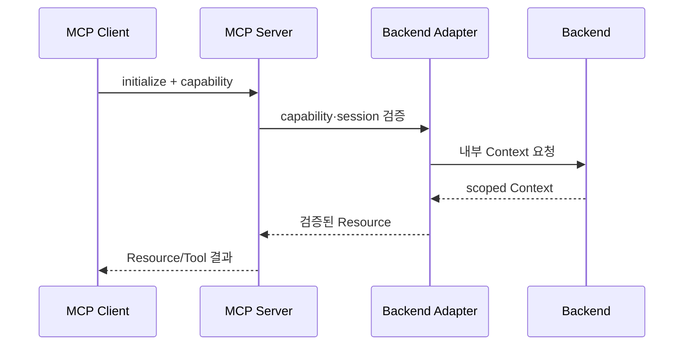

# AI 마피아 MCP 설계서

작성일: 2026-09-09  
문서 기준: 빈 디렉터리에서 현재 구현 상태까지 만들기 위한 MCP runtime 설계

## 1. 목적과 경계

MCP runtime은 AI가 Backend의 제한된 게임 정보와 행동 계약을 protocol 방식으로
사용할 수 있게 한다. MCP는 게임 규칙·승패·DB·Redis를 소유하지 않으며, 모든 실제
상태 변경은 Backend 내부 API와 Game Engine을 거친다.

```text
MCP Client
  → MCP session / Resource / Prompt / Tool
  → Backend HTTP adapter
  → Backend 내부 Context·Action API
  → Game Engine·PostgreSQL
```

## 2. MCP 서버 구성

- `main`: 서버 생성과 transport 실행
- session pool: initialize와 session lifecycle
- Resource registry: 게임 Context Resource 등록
- Prompt registry: AI 실행에 필요한 공통 지침 등록
- Tool registry: action 제출 Tool 등록
- Backend adapter: 내부 HTTP 호출과 응답 변환
- context schema: Resource 응답 계약 검증
- audit: 호출 metadata와 오류 기록

MCP runtime 내부에 DB·Redis client를 두지 않는다. 비어 있는 integration directory는
향후 확장 지점일 뿐 현재 데이터 접근 경로로 간주하지 않는다.

## 3. Resource 설계

Resource는 현재 게임에서 actor가 볼 수 있는 정보만 제공한다. Resource의 구체적인
data는 Backend 내부 API 응답을 검증한 뒤 전달한다.

| Resource 범주 | 목적 | 허용 정보 |
|---|---|---|
| public game | 공통 게임 상황 | phase, 생존자, 공개 사건, 공개 발언 |
| own context | 자기 actor 정보 | 자신의 role·fact·persona·허용 상태 |
| turn context | 현재 행동 조건 | window, deadline, 허용 action, valid target |
| persona/instruction | 표현 규칙 | 말투·표현 성향 등 비규칙 정보 |
| guide/summary | 게임 진행 안내 | 공개된 규칙·현재 단계 안내 |

Resource 요청마다 game·actor·window·state version을 binding한다. MCP 요청이 임의의
actor id나 scope를 지정해 권한을 확장할 수 없게 한다.

## 4. Prompt 설계

Prompt는 모델에게 전달할 역할·현재 단계·출력 계약을 조립하는 보조 표면이다.

- prompt가 게임 상태를 변경하지 않는다.
- prompt에 capability secret과 내부 인증값을 포함하지 않는다.
- prompt가 Backend의 허용 action을 변경하지 않는다.
- prompt의 자연어 지침보다 API schema와 Game Engine 검증이 우선한다.

## 5. Tool 설계

Tool은 Backend가 허용한 action을 전달하는 얇은 adapter다.

| Tool 범주 | 목적 | 서버 검증 |
|---|---|---|
| action proposal | 발언·PASS·투표·밤 행동 제출 | action·target·window·version |
| context refresh | 최신 actor Context 재조회 | actor scope·session |
| result check | 제출 receipt와 반영 결과 확인 | proposal binding |

Tool은 모델이 직접 선택한 target이나 phase를 신뢰하지 않는다. Tool 실행 전후로
capability, session, actor, game, window, phase, target, state version을 확인한다.

## 6. Session·권한 설계



- capability는 작업 범위·actor·게임·만료 시간에 binding한다.
- initialize 단계에서 session을 검증하고, 만료·폐기된 capability는 거부한다.
- session이 유효해도 Backend의 매 요청 권한·상태 검증은 생략하지 않는다.
- capability 원문은 응답·로그·화면에 노출하지 않는다.

## 7. 실패 처리

| 상황 | MCP 처리 |
|---|---|
| 잘못된 Resource scope | 요청 거부, private 정보 반환 금지 |
| malformed Context | 계약 오류로 중단, 임의 기본값 생성 금지 |
| Backend timeout | 제한된 재시도 또는 typed dependency 오류 |
| capability 만료 | 새 작업 없이 종료 |
| action stale | `STALE` 결과 반환, 새 target 추정 금지 |
| duplicate proposal | 기존 receipt replay |
| Backend commit 불명 | 원장 확인 전 재제출 금지 |

## 8. 감사·관찰성

기록 대상은 request id, game/job/window 식별자, Resource·Tool 종류, 결과 code,
소요 시간, 상태 version이다. 다음은 기록하지 않는다.

- raw capability
- secret과 token
- private Context 원문
- raw prompt
- 모델 내부 추론 전문

## 9. 구축 순서와 완료 기준

1. MCP domain·schema·port 정의
2. Backend HTTP adapter
3. session pool과 initialize 검증
4. Resource registry
5. Prompt registry
6. Tool registry
7. audit와 redaction
8. 정상 왕복·scope 격리·만료·timeout·중복·stale 검증

완료 기준은 MCP를 중지하거나 오류가 발생해도 Backend 원장과 게임 규칙이 안전하게
유지되고, MCP를 통해서도 Backend가 허용하지 않은 정보·행동을 얻을 수 없는 것이다.
