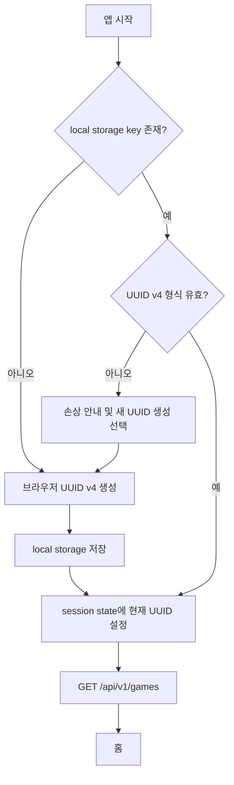
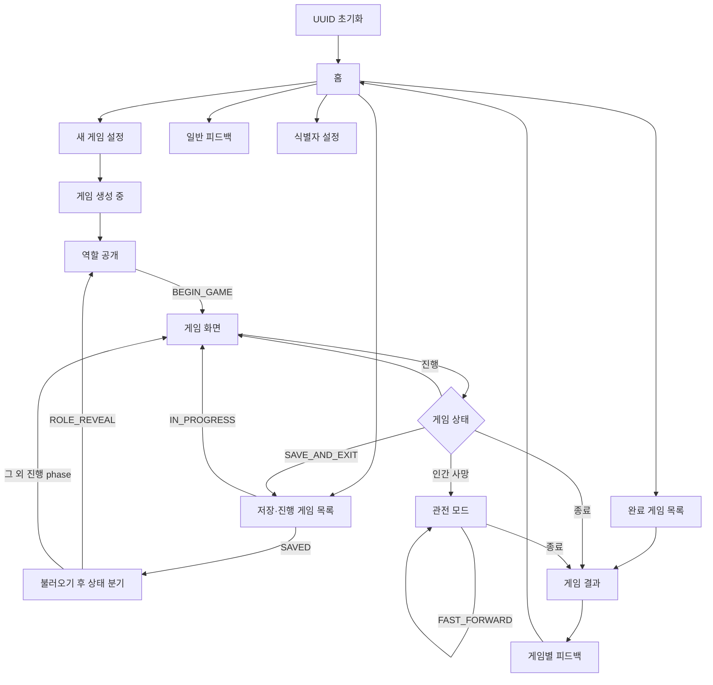
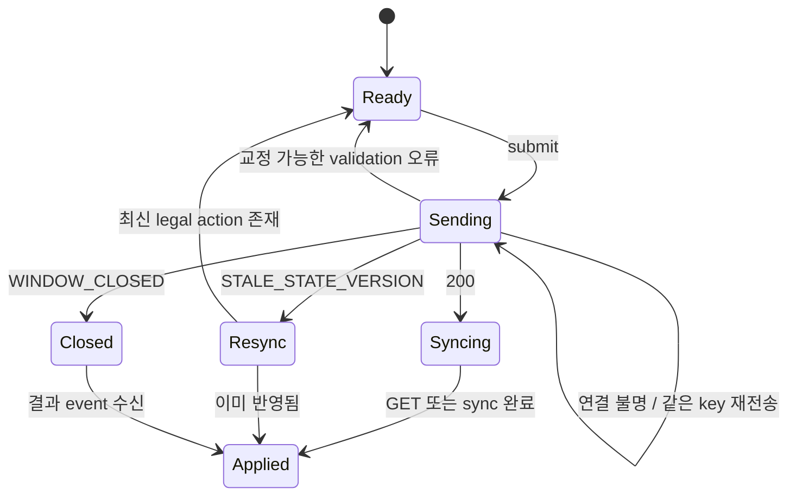
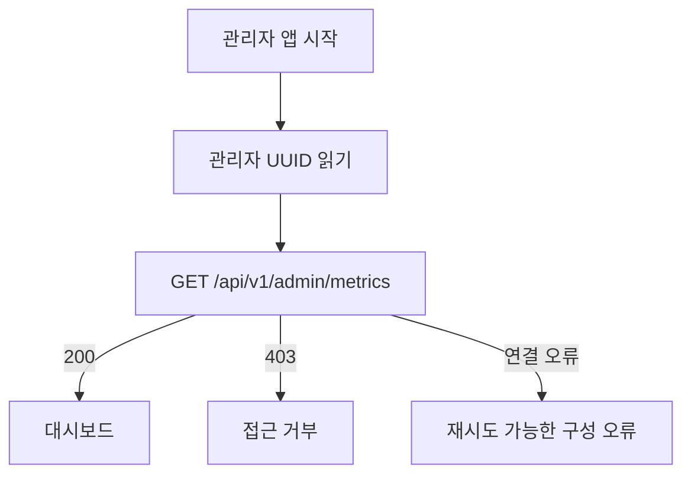

# AI 마피아 MVP 화면 흐름도

**상위 계약:** [AI_MAFIA_MASTER_PLAN.md](AI_MAFIA_MASTER_PLAN.md)

**API 계약:** [AI_MAFIA_API_SPEC.md](AI_MAFIA_API_SPEC.md)

**대상 UI:** `frontend_user` Streamlit, `frontend_admin` Streamlit

이 문서는 사용자·관리자 화면, 화면 상태, API 호출, 오류 복구와 반응형 동작의
정본이다. 화면은 Backend snapshot과 `legal_actions`를 표현하며 게임 규칙을 자체
판정하지 않는다.

## 1. UX 원칙

- 로그인 화면을 제공하지 않는다. UUID 초기화가 끝나면 바로 홈을 표시한다.
- 사용자가 기억해야 할 핵심은 현재 phase, 내 역할, 남은 시간과 지금 가능한 행동이다.
- 다른 player의 비공개 정보는 DOM, Streamlit session state와 client log에도 넣지 않는다.
- countdown은 안내용이다. 0이 되면 제출 UI를 잠그고 Backend 확정 event를 기다린다.
- 변경 요청을 낙관적으로 성공 처리하지 않는다. Backend terminal 결과를 받은 뒤
  GET 또는 sync로 현재 snapshot을 확인하고 화면을 갱신한다.
- 긴 게임에서 refresh·reconnect·save/resume이 같은 상태를 복원해야 한다.
- 사망 뒤에는 입력보다 관전 정보와 빠른 진행 선택을 명확히 보여 준다.
- 사용자 note, OAuth, 프로필, Provider 비용·token·timeout 설정 UI를 만들지 않는다.

## 2. 브라우저 사용자 UUID

### 2.1 저장 key

| 앱 | same-origin local storage key |
|---|---|
| 일반 사용자 `:8501` | `ai_mafia_user_id_v1` |
| 관리자 `:8502` | `ai_mafia_admin_user_id_v1` |

port가 다른 두 앱은 local storage origin이 다르므로 값을 공유한다고 가정하지 않는다.
Streamlit custom component는 UUID 문자열만 읽고 쓰며 Backend secret이나 게임
snapshot을 저장하지 않는다.

### 2.2 초기화 흐름



- UUID 생성은 browser crypto API를 사용한다. 시간·난수 결합의 자체 UUID 구현을
  사용하지 않는다.
- Streamlit rerun 때마다 UUID를 새로 만들지 않는다.
- Backend 목록 요청 실패는 UUID를 삭제하거나 바꾸지 않는다.
- local storage가 차단된 브라우저에서는 UUID를 session 안에서만 임시 유지하고
  게임 복구가 보장되지 않는다는 경고를 표시한다.

### 2.3 식별자 보기·복구

설정 drawer의 `내 게임 식별자`에서 현재 UUID를 확인·복사할 수 있다. 복구 입력은
다음 절차를 따른다.

1. UUID v4 형식을 client에서 검사한다.
2. `이 식별자는 비밀번호가 아니며 아는 사람이 같은 게임을 볼 수 있습니다` 경고를
   표시한다.
3. 확인 modal에서 현재 UUID 교체를 한 번 더 승인받는다.
4. 새 값을 local storage와 session state에 저장하고 게임 cache를 모두 비운다.
5. `GET /api/v1/games`를 호출해 새 scope의 홈으로 이동한다.

서버 기반 계정 찾기, 이메일 복구와 UUID 병합은 없다. UUID를 잃어버리면 기존 게임을
복구할 수 없음을 첫 게임 생성 전 한 번 안내한다.

## 3. 전체 사용자 흐름



## 4. 공통 화면 shell

### 4.1 상단 bar

- 좌측: `AI 마피아` wordmark, 누르면 홈 이동
- 중앙: 게임 안에서는 scenario 제목, day·round와 phase badge
- 우측: 연결 상태, 저장 버튼, 설정 drawer
- 모바일: wordmark와 phase만 남기고 나머지는 overflow menu로 이동

연결 상태:

| 표시 | 조건 | 동작 |
|---|---|---|
| `실시간 연결` | SSE가 최신 Front sequence까지 적용됨 | 없음 |
| `다시 연결 중` | SSE 끊김, polling 복구 중 | command 중복 전송 금지 |
| `상태 확인 필요` | sync도 실패 | retry와 홈 이동 제공 |

### 4.2 공통 message

- global 오류는 상단 고정 banner로 표시한다.
- field validation은 해당 입력 바로 아래 표시한다.
- 일시적 성공 toast는 command type과 결과만 말하고 비공개 target을 공용 log에 쓰지
  않는다.
- request ID는 오류 상세 `문제 해결 정보`를 펼쳤을 때만 보여 준다.

### 4.3 로딩 skeleton

앱 시작, 게임 생성, snapshot 최초 로드에는 레이아웃 크기가 유지되는 skeleton을
사용한다. spinner만 있는 빈 화면을 만들지 않는다. 10초 이상 응답이 없어도 LLM
timeout 설정 UI를 표시하지 않으며 Backend 연결 오류 복구 UI만 제공한다.

## 5. 홈

### 5.1 목적

새 게임 시작과 기존 게임 복귀를 한 화면에서 제공한다.

### 5.2 구성

```text
[AI 마피아 소개와 새 게임 시작 CTA]

[이어하기]
  진행 중 또는 저장 게임 card 최대 3개

[최근 완료 게임]
  결과 card 최대 3개

[게임 방법] [일반 피드백] [내 게임 식별자]
```

게임 card:

- scenario 제목
- `진행 중`, `저장됨`, `완료`, `복구 필요` status badge
- day·round·phase
- 마지막 갱신 상대 시각
- `계속하기`, `불러오기`, `결과 보기` 중 하나

API:

- 진입: `GET /api/v1/games?limit=20`
- 빈 목록: 오류가 아닌 첫 게임 안내
- 새로고침: 같은 endpoint, UUID는 유지

## 6. 새 게임 설정

### 6.1 입력

- 전체 인원 segmented control: `6`, `7`, `8`, `9`
- 선택 인원별 역할 구성 preview
- 규칙 요약: 인간 1명, 첫날 무투표, 밤 20초, 투표 30초, 최대 밤 5회
- `게임 만들기` primary button
- `취소` secondary button

시나리오, 역할과 persona는 사용자가 고르지 않는다. 반복 플레이 편향을 줄이기 위해
Backend가 결정적으로 선택한다.

### 6.2 제출

```http
POST /api/v1/games
{
  "player_count": 6,
  "ruleset_version": "mystery-v1",
  "scenario_version": "scenario-v1"
}
```

- button을 누를 때 UUID v4 `Idempotency-Key`를 한 번 만들고 terminal 응답 전까지
  session state에 보관한다.
- 처리 중 button과 인원 입력을 잠근다.
- 네트워크 결과를 모르면 같은 key와 body로만 재시도한다.
- 성공하면 응답의 `snapshot_url`을 GET하고 현재 snapshot으로 역할 공개 또는 이미
  진행된 게임 화면으로 이동한다.

## 7. 역할 공개

### 7.1 표시

- scenario 제목, 배경, 피해자와 장소
- `내 역할` card
- 역할 능력과 승리 조건 한 줄 설명
- 자신의 알리바이와 관찰 정보
- 전체 인원과 시작 마피아 수
- `게임 시작` button

다른 player의 role, persona private prompt와 seed는 화면 상태에 존재하지 않아야 한다.
마피아여도 다른 마피아를 알려주지 않는다.

### 7.2 시작

`게임 시작`은 `BEGIN_GAME` command다. 성공 전에 게임 화면으로 낙관 이동하지 않는다.
성공하면 sync하고, stale version이면 최신 snapshot을 받아 이미 시작됐는지 확인한 뒤
게임 화면으로 복구한다.

## 8. 게임 화면

### 8.1 Desktop 배치

```text
┌────────────────────────────────────────────────────────────┐
│ scenario / day·phase / connection / save                  │
├───────────────┬──────────────────────────────┬─────────────┤
│ 플레이어 목록 │ 사건·공개 대화·결과 timeline │ 내 정보     │
│ 생존·탈락     │                              │ 역할·사실   │
├───────────────┴──────────────────────────────┴─────────────┤
│ 현재 행동 panel: 안내 / countdown / target / submit      │
└────────────────────────────────────────────────────────────┘
```

### 8.2 Mobile 배치

- 상단: phase·countdown sticky bar
- 본문: timeline 한 column
- player 목록과 내 정보: 접을 수 있는 sheet
- 행동 panel: 화면 하단 sticky 영역, safe-area 반영
- target button은 최소 44px touch target을 유지한다.
- dialog와 sheet 안에서만 page scroll이 잠기며 focus가 바깥으로 나가지 않는다.

### 8.3 플레이어 목록

- 좌석순으로 표시한다.
- 생존, 밤 사망, 처형과 내 player를 색상 이외 icon·text로도 구분한다.
- 처형 role만 즉시 표시하고 밤 사망 role은 숨긴다.
- target을 선택하는 phase에는 `valid_targets`만 활성화한다.
- 자기 자신 금지 규칙은 disabled 표시뿐 아니라 Backend validation에 의존한다.

### 8.4 공개 timeline

event를 `front_sequence` 순으로 표시한다.

| Event | 화면 표현 |
|---|---|
| `GAME_BEGAN` | 사건 안내와 고정 시작 문장 |
| `TURN_OPENED` | 현재 발언자 강조 |
| `PLAYER_SPOKE` | player 이름과 최대 200자 발언 bubble |
| `PLAYER_PASSED` | `발언을 넘겼습니다` compact row |
| `NIGHT_RESOLVED` | 사망자 또는 `사망자가 없습니다` |
| `VOTE_RESOLVED` | 후보별 득표수, 동률·재투표 안내 |
| `PLAYER_EXECUTED` | 탈락 player와 공개 role |
| `GAME_SAVED` | 저장 시각 안내 |
| `GAME_ENDED` | 승리 진영과 결과 CTA |

HTML을 허용하지 않고 plain text로 렌더링한다. 내부 event payload 전체를 debug UI로
출력하지 않는다.

### 8.5 내 정보 panel

- 역할 badge와 능력 설명
- 알리바이·관찰 정보
- 탐정의 과거 조사 결과
- 현재 생존·관전 상태
- 의사의 보호 선택은 해당 밤 제출 완료 여부만 보여 주고 성공 여부는 표시하지 않는다.
- 공격·보호·투표 target은 public timeline에 표시하지 않는다.

## 9. Phase별 행동 UI

| Phase·상태 | 안내 | 입력 | 완료 후 |
|---|---|---|---|
| `DAY_DISCUSSION`, 내 차례 | 최대 200자 발언 또는 넘기기 | textarea, 글자수, `발언`, `PASS` | panel 잠금, 다음 turn 대기 |
| `DAY_DISCUSSION`, 다른 차례 | 현재 발언자 표시 | 없음 | event 대기 |
| `NIGHT_ACTION`, 마피아 | 공격 대상 선택, 20초 | target radio, 제출 | 대상 비공개 유지 |
| `NIGHT_ACTION`, 탐정 | 조사 대상 선택, 20초 | target radio, 제출 | private 결과 event 대기 |
| `NIGHT_ACTION`, 의사 | 보호 대상 선택, 20초 | target radio, 제출 | 성공 여부 숨김 |
| `NIGHT_ACTION`, 시민 | 밤이 지나가는 중 | 없음 | 결과 대기 |
| `DAY_VOTE` | 처형 후보 선택, 30초 | target radio, 투표 | 집계 전 선택 비공개 |
| `REVOTE` | 동률 후보 중 선택, 30초 | 축소 target radio | 결과 대기 |
| `FINAL_DISCUSSION` | 마지막 발언 또는 넘기기 | 낮과 같은 입력 | 최종 지목 대기 |
| `FINAL_ACCUSATION` | 마지막 대상 선택, 30초 | target radio, 투표 | 종료 결과 대기 |
| 인간 사망 | 관전 안내 | `빠른 진행`, `저장하고 나가기` | 공개 event와 기존 본인 정보 표시 |
| `SAVED` | 저장 상태 | `불러오기` | 같은 phase 복원 |
| `COMPLETED` | 승리 진영 | `결과 보기` | 결과 화면 |

### 9.1 countdown

- snapshot의 `server_time`, `deadline_at`, `remaining_ms`로 최초 offset을 계산한다.
- 10초 남은 밤 행동, 15초와 5초 남은 투표에 시각·텍스트 경고를 준다.
- browser timer가 0이 되면 submit button을 비활성화하지만 자동 target을 client에서
  선택하거나 제출하지 않는다.
- server가 `WINDOW_CLOSED`를 반환하면 결과 sync로 전환한다.
- tab background·sleep 뒤 복귀하면 local countdown을 믿지 않고 즉시 sync한다.

### 9.2 command 제출 상태



- 한 화면 action마다 한 `Idempotency-Key`만 유지한다.
- response를 받지 못했다고 새 key로 자동 재전송하지 않는다.
- `ACTION_ALREADY_SUBMITTED`이면 snapshot을 다시 받아 제출 완료 상태를 표시한다.
- stale sync 후 원래 target이 더 이상 유효하면 자동으로 다른 target을 선택하지 않는다.

## 10. 저장과 불러오기

### 10.1 저장

- 상단 `저장하고 나가기`를 누르면 현재 phase·남은 시간이 저장된다는 확인 modal을
  표시한다.
- command 처리 중 또는 server resolution 중에는 button을 잠시 비활성화한다.
- 성공 뒤 local game cache를 비우고 홈의 `이어하기` section으로 이동한다.
- 저장 실패 시 게임 화면에 남고 UUID·현재 snapshot을 삭제하지 않는다.

### 10.2 불러오기

1. card 선택 시 `GET /games/{game_id}`로 최신 상태를 확인한다.
2. `SAVED` snapshot에 action window가 있으면 `paused=true`, `deadline_at=null`이다.
   timed window의 `remaining_ms`는 동결 표시만 하고 countdown을 시작하지 않는다.
   `ROLE_REVEAL`처럼 window가 없는 저장 상태는 `action_window=null`이다.
3. 사용자가 `불러오기`를 눌러 `RESUME` command를 제출한다.
4. 성공 뒤 GET 또는 sync한 현재 snapshot을 기준으로 화면을 다시 분기한다.
   `ROLE_REVEAL`이면 역할 공개로, 다른 phase면 게임 화면으로 이동한다.
5. timed window만 새 `deadline_at`으로 countdown을 시작한다. untimed 발언 window는
   deadline 없이 복원한다.
6. 이미 다른 tab에서 재개됐다면 stale snapshot을 교체하고 현재 phase 화면으로 이동한다.

`IN_PROGRESS` game card의 `계속하기`는 `RESUME`을 보내지 않고 snapshot만 연다.

## 11. 관전과 빠른 진행

- 인간 player의 `alive=false`를 받은 즉시 입력 panel을 제거한다.
- `관전 중` badge와 `게임은 AI 플레이어끼리 계속 진행됩니다` 안내를 고정한다.
- 공개 timeline, 생존자, 후보별 투표 결과, 밤 사망자와 이미 허용된 본인의 역할·개인
  정보만 볼 수 있다.
- 다른 player의 role·private event는 종료 전 보여 주지 않는다.
- `FAST_FORWARD`는 한 번 확인 후 제출하고 snapshot의
  `fast_forward_enabled=true`를 받은 뒤 활성화 상태를 표시한다.
- 빠른 진행 중에도 SSE Front sequence 순서, 공개 범위와 확정 RNG 결과를 그대로
  사용한다.
- 사용자가 화면을 닫아도 Backend 진행과 deadline은 중단하지 않는다.

## 12. 결과 화면

### 12.1 구성

- 승리 진영과 종료 이유
- scenario, 전체 day·round와 주요 사건 요약
- 전체 player의 최종 role과 탈락 시점
- 밤별 공격·보호·조사 결과
- 일반·재·최종 투표의 player별 선택과 자동 선택 여부
- 주요 공개 발언 timeline
- `게임별 피드백`, `새 게임`, `홈으로` CTA

결과 화면은 `status=COMPLETED` snapshot의 `result`만 사용한다. Front가 event를
조합해 승패나 숨은 역할을 추측하지 않는다. `FAILED` game은 공개 가능한 마지막 상태와
고정 복구 불가 안내만 보여 주고 전체 비공개 정보를 열지 않는다.

## 13. 피드백 화면

### 13.1 일반 피드백

- 홈에서 접근한다.
- 별점 1~5, 선택 comment 최대 1000자, tag 최대 5개다.
- 제출 성공 뒤 입력을 비우고 홈으로 돌아간다.

### 13.2 게임별 피드백

- 완료 결과 화면에서만 접근한다.
- game ID와 scenario 제목은 읽기 전용으로 표시한다.
- 같은 game에 이미 제출했다면 form 대신 완료 안내를 표시한다.
- 입력을 게임 note로 저장하거나 Agent에 전달하지 않는다.

두 화면 모두 submit 때 새 idempotency key를 만들고 terminal 응답 전까지 유지한다.

## 14. 오류·복구 화면

| API code·상황 | 사용자 동작 |
|---|---|
| `MISSING_USER_ID`·손상 UUID | 식별자 초기화 화면으로 이동 |
| `GAME_NOT_FOUND` | `이 식별자에서 게임을 찾을 수 없습니다`, 홈 이동 |
| `STALE_STATE_VERSION` | 입력 보존 없이 즉시 sync, 최신 action 재확인 |
| `ACTION_ALREADY_SUBMITTED` | snapshot refresh 후 제출 완료 표시 |
| `WINDOW_CLOSED` | action panel 잠금, 결과 event sync |
| `PLAYER_DEAD` | 관전 mode snapshot으로 교체 |
| `INVALID_PHASE` | snapshot refresh, 계속되면 홈·request ID 제공 |
| `GAME_BUSY` | 짧은 backoff 뒤 같은 읽기 sync, mutation 자동 새 key 금지 |
| `DEPENDENCY_UNAVAILABLE` | 현재 화면과 UUID 유지, 재시도 button |
| SSE disconnect | `다시 연결 중`, polling fallback |
| local storage 사용 불가 | session-only 경고와 UUID 복사 안내 |

validation 오류는 사용자가 수정한 뒤 새 request body에 새 idempotency key를 사용한다.
결과 불명 네트워크 오류만 원래 key를 재사용한다.

## 15. 관리자 화면

관리자 앱은 별도 origin이므로 최초 실행에 allowlist UUID를 직접 입력해
`ai_mafia_admin_user_id_v1`에 저장한다. 로그인·비밀번호 UI로 표현하지 않는다.

### 15.1 접근 확인



- `403`이면 dashboard component와 partial data를 렌더링하지 않는다.
- allowlist UUID 변경 drawer는 일반 사용자 복구와 같은 경고·확인 절차를 쓴다.
- 공개 인터넷에서 사용할 수 있는 관리자 인증이라고 안내하지 않는다.

### 15.2 대시보드

- 게임 생성·완료·저장 수, 완료율, 평균 round, 진영별 승리, 자동 행동, 피드백 평균
- status·phase filter가 있는 game 목록
- game 상세 drawer: operational 상태, 공개 event, window metadata, failure code
- 진행 중 role·개별 행동·private context는 표시하지 않는다.
- 수정, 강제 종료, 삭제, Provider 변경과 LLM 비용·token·timeout panel은 없다.

## 16. 화면 상태 소유권

| 상태 | 원본 | Front 저장 범위 |
|---|---|---|
| `user_id` | browser local storage | session state mirror |
| game snapshot | Backend | 현재 화면 session cache |
| `state_version`·`front_sequence`·`operation_index` | Backend | 마지막 적용 batch 위치 |
| idempotency key | Front | 요청 terminal 결과까지 session state |
| countdown | Backend deadline | 표시용 계산값 |
| 선택 중 target·message | 사용자 입력 | 현재 form session state |
| role·private event | Backend projection | 현재 game session에만, local storage 금지 |
| 연결 상태 | Front transport | session state |

URL query parameter에는 `user_id`, role, private 정보와 capability를 넣지 않는다. URL은
필요하면 opaque `game_id`만 포함하고 Backend 소유권 검사를 항상 거친다.

## 17. 동기화 전략

1. 게임 진입 시 `GET /games/{game_id}` snapshot과 `last_sequence`를 받는다.
2. SSE를 열고 마지막 Front sequence 이후 완전한 `game_sync` batch를 적용한다.
3. SSE가 끊기면 `GET /sync` polling으로 전환한다.
4. `(game_id, front_sequence, operation_index)` 중복은 무시한다.
5. Front sequence·batch index gap, 불완전 batch, 알 수 없는 operation 또는 local
   version 역행을 발견하면 batch를 부분 적용하지 않고 전체 snapshot을 다시 받는다.
6. snapshot 교체 시 제출 중 idempotency receipt 결과를 확인하기 전 같은 command를
   새 key로 만들지 않는다.

`mode=SNAPSHOT` 응답은 `operations=[]`이며 snapshot을 한 번만 교체한다. delta는
sequence별 모든 operation을 받은 뒤 하나의 UI 갱신으로 적용해 같은 transaction의
phase와 action panel이 중간 상태로 보이지 않게 한다.

Streamlit rerun은 transport reconnect를 일으킬 수 있으므로 화면 widget state와
authoritative game state를 분리한다. callback 안에서 domain phase를 직접 바꾸지 않는다.

## 18. 접근성·반응형

- 모든 입력은 보이는 label과 programmatic label을 가진다.
- phase, 생존·탈락, 승패와 연결 상태를 색상만으로 표현하지 않는다.
- countdown 경고는 `aria-live=polite`, 제출 오류는 focus 가능한 alert로 제공한다.
- 새 event가 와도 사용자가 읽는 위치를 강제로 timeline 끝으로 이동하지 않는다.
- keyboard만으로 target 선택, 발언, 저장과 modal 취소가 가능해야 한다.
- focus order는 header, timeline, 정보, action 순으로 일관되게 유지한다.
- `prefers-reduced-motion`에서 card flip과 신규 event animation을 끈다.
- 320px 너비에서 가로 overflow 없이 주요 command를 사용할 수 있어야 한다.
- 200% 확대에서 text나 button이 겹치지 않아야 한다.

## 19. Front 구현 경계

| 영역 | 책임 |
|---|---|
| `frontend_user/app.py` | route·session 초기화만 담당하는 얇은 entrypoint |
| `frontend_user/app_pages/` | 홈, 생성, 역할, 게임, 결과, 피드백 화면 조율 |
| `frontend_user/components/` | 공통 card, timeline, countdown, local storage bridge |
| `frontend_user/core/api_client.py` | `X-User-Id`, request ID, idempotency와 HTTP 오류 변환 |
| `frontend_user/core/sync.py` | snapshot·operation 검증과 SSE/polling 전환 |
| `frontend_user/core/view_models.py` | API model을 안전한 화면 model로 변환 |
| `frontend_admin/` | allowlist UUID, read-only dashboard와 별도 API client |

기존 `auth/`, login page, OIDC secrets 검사와 Front HMAC 코드는 `WU-F1`에서 실행
경로와 테스트에서 제거한다. 파일 삭제·이동이 필요하면 실제 대상 목록을 WU 시작 전에
확정하고 README 구조를 함께 갱신한다.

## 20. 화면 검증

- UUID 최초 생성, rerun 유지, 손상 복구, 수동 교체와 storage 차단
- 홈 loading·empty·error와 status별 card CTA
- 6~9명 create validation, 중복 click·결과 불명 재시도
- 역할 화면에서 본인 정보만 존재하는지 DOM·session 검사
- 모든 phase의 legal action 표시와 금지 action 미표시
- 200자 경계, target allowlist와 제출 중 이중 click
- 밤 10초, 투표 15초·5초 경고와 background 복귀 sync
- stale, closed, already-submitted, dead와 busy 오류 복구
- save/resume 남은 시간, refresh와 다중 tab 상태 변경
- SSE reconnect, polling fallback, Front sequence·batch index duplicate·gap과 AI private
  event 비노출
- 관전 command 제거와 빠른 진행
- 종료 전 role·행동 비노출, 종료 후 결과 공개
- 일반·게임별 feedback union과 game당 한 건
- 관리자 allowlist fail-closed와 read-only 경계
- mobile 320px, keyboard, screen reader, reduced motion과 200% zoom
- OAuth·로그인·사용자 note·LLM token·비용·timeout UI가 없는지 회귀 검사
